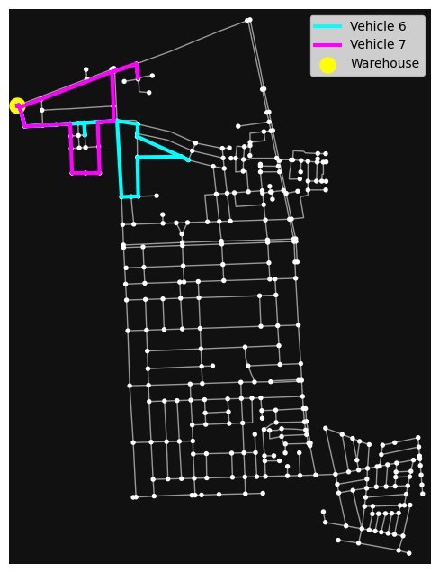
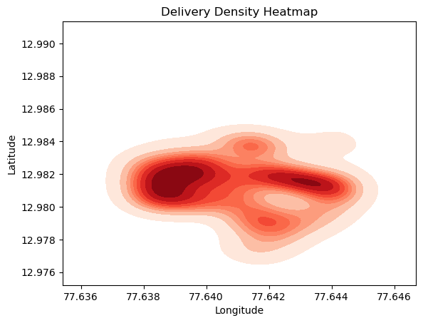
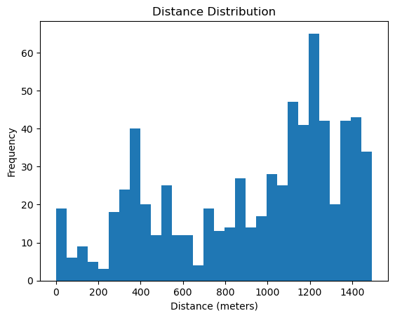

# 🚚 Optimization of Last-Mile Delivery Routes using VRP

> Real-world delivery route optimization using Vehicle Routing Problem (VRP), OpenStreetMap road networks, and OR-Tools in Bengaluru.

---

## 📌 Project Overview

This project focuses on solving the **Last-Mile Delivery Optimization Problem** using the **Vehicle Routing Problem (VRP)** approach.

Using real-world road network data from Bengaluru (Indiranagar region), the system generates optimized delivery routes that minimize total travel distance while efficiently covering all delivery locations.

The project combines:
- Optimization Techniques
- Graph Algorithms
- Statistical Analysis
- Geographic Data Processing
- Data Visualization

---

## 🎯 Objectives

- Minimize total delivery distance
- Optimize vehicle routes
- Improve delivery efficiency
- Analyze delivery demand distribution
- Compare optimized vs random routing
- Perform scalability analysis using multiple vehicles

---

## 🛠️ Technologies Used

| Technology | Purpose |
|---|---|
| Python | Core Implementation |
| OSMnx | Road Network Extraction |
| NetworkX | Graph Operations |
| OR-Tools | Vehicle Routing Optimization |
| Matplotlib | Data Visualization |
| Pandas & NumPy | Data Processing |

---

## 🌍 Real-World Dataset

- Road network extracted using **OpenStreetMap**
- Bengaluru (Indiranagar region)
- Building footprints converted into delivery points
- Real shortest-path routing used instead of Euclidean distance

---

## 📊 Statistical Analysis

### Delivery Distance Statistics

| Metric | Value |
|---|---|
| Mean Distance | 594.82 m |
| Standard Deviation | 273.01 m |
| Minimum Distance | 31.18 m |
| Maximum Distance | 1382.01 m |

### Key Insights
- Most deliveries occur near the warehouse
- Delivery demand is highly localized
- Delivery time increases with distance
- Optimized routes significantly reduce travel cost

---

# 📈 Results & Visualizations

## 🚦 Optimized Vehicle Routes
Efficient delivery paths generated using VRP optimization.



---

## 📍 Delivery Density Heatmap
Shows high-demand delivery regions near the warehouse.



---

## 📉 Delivery Distance Distribution
Histogram showing localized delivery demand.



---

## 🔄 Random vs Optimized Routing
Comparison showing distance reduction after optimization.


---

# ⚙️ Methodology

1. Extract Bengaluru road network
2. Identify building locations
3. Generate delivery demand points
4. Compute shortest-path distance matrix
5. Apply Vehicle Routing Problem (VRP)
6. Optimize routes using OR-Tools
7. Visualize optimized delivery paths

---

# 📌 Mathematical Model

The problem is modeled as a **Vehicle Routing Problem (VRP)**.

### Objective:
Minimize total travel distance:

\[
\min \sum_{i \in N}\sum_{j \in N} d_{ij}x_{ij}
\]

Where:
- \(d_{ij}\) = shortest path distance
- \(x_{ij}\) = routing decision variable

---

# 🚀 Key Achievements

✅ Real-world route optimization  
✅ Reduced delivery distance  
✅ Efficient vehicle utilization  
✅ Statistical analysis & visualization  
✅ Practical logistics optimization system  

---

# 🔮 Future Improvements

- Real-time traffic integration
- Dynamic order allocation
- Time-window constraints
- AI-based route prediction
- Large-scale fleet optimization

---

# 📂 Project Structure

```bash
VRP-Last-Mile-Delivery-Optimization/
│
├── notebooks/
├── images/
├── report/
├── README.md
└── requirements.txt